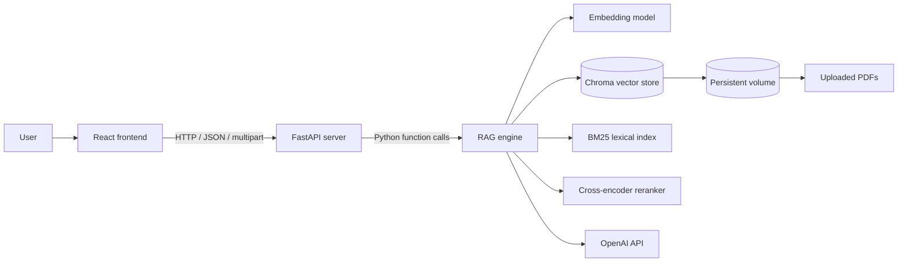
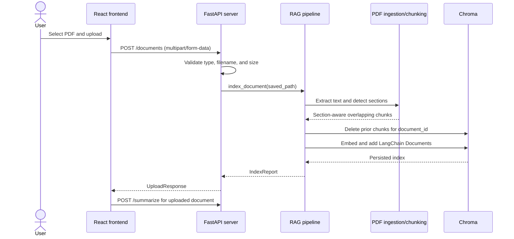
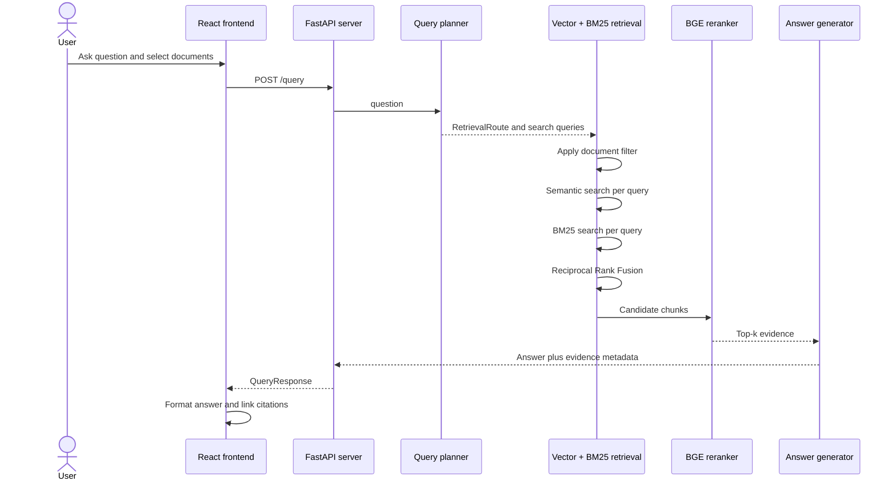
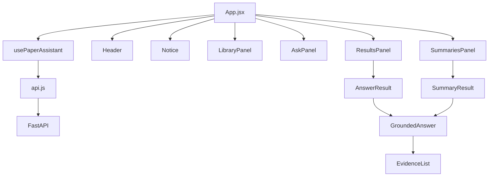

# Research Paper RAG Assistant: Features and System Architecture

## 1. Executive Summary

The Research Paper RAG Assistant is a web application for uploading research papers, indexing their contents, generating structured summaries, and asking grounded questions across one or more selected papers.

The system uses Retrieval-Augmented Generation (RAG): it does not send an entire PDF to a language model and ask it to answer from memory. Instead, it:

1. Extracts and structures text from each PDF.
2. Splits the text into overlapping, section-aware chunks.
3. Stores semantic embeddings and chunk metadata in Chroma.
4. Plans one or more searches for each user question.
5. Combines semantic vector search with lexical BM25 search.
6. Reranks the retrieved chunks with a cross-encoder.
7. Produces either a deterministic extractive response or an OpenAI-generated answer grounded only in the retrieved evidence.
8. Returns the answer and its evidence to the browser, where citations link to the corresponding chunks.

The architecture is separated into three layers:

- **React frontend:** user interaction, client state, formatted answers, and evidence navigation.
- **FastAPI server:** HTTP contracts, validation, file handling, CORS, and translation between API schemas and engine results.
- **Python RAG engine:** PDF ingestion, chunking, indexing, retrieval, reranking, answer generation, summarization, evaluation, and persistence.



## 2. Primary Features

### Document library

- Upload one PDF at a time.
- Validate PDF content type and enforce a 50 MB upload limit.
- Index documents into a persistent vector store.
- List indexed documents with filename and chunk count.
- Select one or multiple documents for a question.
- Delete a document, its indexed chunks, and its stored PDF.
- Refresh the library from the server.

### Per-document summaries

- A newly uploaded and indexed document is summarized automatically.
- Previously indexed documents have an individual **Summarize** button.
- Summarization is always scoped to one document, preventing accidental multi-document summaries.
- Completed summaries stack in collapsible sections.
- Selecting **View summary** expands the existing summary instead of making another API request.
- Each summary contains five fields:
  - Problem
  - Method
  - Dataset
  - Results
  - Limitations

### Grounded question answering

- Ask a free-form question about selected documents.
- Select one or multiple documents as the retrieval scope.
- Set the number of evidence chunks with `top_k` from 1 to 20.
- Choose between:
  - `extractive`: deterministic, no answer-generation LLM call.
  - `openai`: synthesized, evidence-grounded answer from `gpt-4o-mini`.
- Receive evidence with source, section, chunk ID, and text excerpt.

### Readable, traceable output

- Answers and summary fields support paragraphs, numbered lists, and bullet lists.
- Inline enumerations such as `1. ... 2. ...` are converted into stacked lists.
- Valid chunk citations are rendered in a lighter monospace style.
- Clicking a citation opens the evidence section, scrolls to its matching chunk, and highlights it.
- Evidence remains available under collapsible sections to reduce visual noise.

### Responsive workspace

The main layout changes according to available output:

- Controls only: centered document and question workspace.
- Answer or summaries: two-column layout.
- Answer and summaries: controls on the left, answer in the center, summaries on the right.
- Narrow screens collapse to one column.

## 3. Repository Responsibilities

```text
final_proj/
├── frontend/             React and Vite browser application
│   └── src/
│       ├── components/   Presentational and interactive UI components
│       ├── hooks/        Client state and API orchestration
│       ├── styles/       Global, layout, and component styles
│       └── api.js        HTTP client boundary
├── server/               FastAPI transport and validation layer
│   ├── main.py           Endpoints, lifecycle, upload handling
│   ├── schemas.py        Pydantic request and response contracts
│   └── settings.py       Server configuration and CORS
├── rag/                  Framework-independent RAG engine
│   ├── ingestion.py      PDF text extraction
│   ├── chunking.py       Section detection and overlapping chunks
│   ├── indexing.py       LangChain documents and Chroma writes
│   ├── planner.py        LLM planner and deterministic fallback
│   ├── router.py         Intent and retrieval-route definitions
│   ├── retriever.py      Vector search, BM25, RRF, filtering
│   ├── reranker.py       Cross-encoder reranking
│   ├── retrieval.py      Retrieval and answer result assembly
│   ├── answer.py         Extractive and OpenAI answer generation
│   ├── pipeline.py       Public engine API
│   ├── resources.py      Shared model and vector-store singletons
│   ├── evaluation.py     Gold-reference evaluation utilities
│   └── config.py         Models, paths, chunks, summary questions
├── data/raw/             Uploaded PDFs in local development
├── data/chroma/          Persistent Chroma data in local development
└── outputs/              Gold references and benchmark artifacts
```

The boundaries are intentional:

- The RAG engine does not know about HTTP or React.
- The server does not implement retrieval algorithms; it validates requests and calls the engine.
- The frontend does not know how retrieval works; it consumes stable JSON contracts.

## 4. End-to-End System Flow

### 4.1 Application startup

1. Uvicorn creates the FastAPI application.
2. The FastAPI lifespan handler calls `rag.resources.preload()` in a worker thread.
3. The embedding model, Chroma client, and reranker are loaded once and reused.
4. Chroma opens the configured persistent directory.
5. The frontend calls `GET /health` and `GET /documents`.

Preloading increases startup time but prevents the first user query from paying the full model initialization cost.

### 4.2 Upload and indexing



#### PDF extraction

PyMuPDF extracts text blocks page by page. Blocks are ordered using page coordinates and a two-column heuristic to better preserve academic-paper reading order. The ingestion layer normalizes extracted text and trims back matter such as references or appendices when recognized.

#### Section-aware chunking

The chunker detects named and numbered academic headings. Text is grouped under section labels, divided at paragraph and sentence boundaries, and packed into chunks with these defaults:

- Target chunk size: 1,200 characters.
- Overlap: 150 characters.

The overlap protects context that would otherwise be lost at a chunk boundary. Section metadata later supports routes such as author questions targeting `Front Matter`.

#### Indexed document resource

Each chunk becomes a LangChain `Document`:

```python
Document(
    page_content="chunk text",
    metadata={
        "document_id": "bert",
        "source": "bert.pdf",
        "chunk_id": "bert_chunk_0001",
        "section": "Introduction",
    },
)
```

`document_id` is the ownership and filtering key. `chunk_id` is the citation and evidence-navigation key.

### 4.3 Question answering



#### Query planning

The planner converts a user question into a `RetrievalRoute`. A route contains:

```python
RetrievalRoute(
    intent=Intent.METHODS,
    queries=[
        "What architecture does the paper propose?",
        "methods",
        "approaches",
        "framework",
        "architecture",
    ],
    section_filter=None,
    use_vector_search=True,
    use_reranker=True,
    needs_comparison=False,
)
```

When an OpenAI key is available, `gpt-4o-mini` produces a structured plan. If the API is unavailable or the plan cannot be parsed, a deterministic router classifies the question with keywords and builds fallback queries. This provides graceful degradation rather than making retrieval dependent on an external service.

Author and title questions are a special case: they use metadata/section retrieval against `Front Matter` rather than semantic vector search.

#### Multi-document filtering

Selected IDs are converted into a Chroma filter:

```python
{"document_id": "bert"}
```

or:

```python
{"document_id": {"$in": ["bert", "resnet"]}}
```

The filter is applied before semantic and BM25 retrieval. This prevents evidence from unselected papers from entering the candidate set.

#### Hybrid retrieval

The engine uses two complementary retrieval methods:

- **Semantic vector search** finds conceptually related chunks even when wording differs.
- **BM25 lexical search** finds exact terminology, names, acronyms, and benchmark labels.

Each planned query runs through both methods. Their ranked lists are combined with Reciprocal Rank Fusion (RRF):

$$
\operatorname{RRFScore}(d)=\sum_{r\in R}\frac{1}{60+\operatorname{rank}_r(d)}
$$

RRF is used because vector and BM25 scores are not directly comparable. It combines rank positions without requiring score normalization or learned fusion weights.

#### Reranking

The fused candidates are scored by a cross-encoder using the original question and complete chunk text together. Unlike independent embeddings, a cross-encoder directly models query-document interaction. It is more computationally expensive, so it is applied only to the small candidate set rather than the full corpus.

The engine may retrieve a wider candidate pool (at least 12 for multi-query routes), rerank it, and return only the requested `top_k` results.

#### Answer generation modes

**Extractive mode** returns the highest-ranked evidence chunk with its chunk citation. It is deterministic, inexpensive, and guaranteed to remain grounded, but it can read like a paragraph excerpt rather than a synthesized answer.

**OpenAI mode** sends only the retrieved evidence and question to `gpt-4o-mini`. The prompt requires:

- No outside knowledge.
- A citation for each factual claim.
- Exact chunk IDs.
- Concise paragraphs or readable lists.
- A fixed missing-answer response when evidence is insufficient.

After generation, citations are validated against the supplied evidence. An empty response or invalid citation structure is rejected and replaced by the missing-answer response. This favors traceability over accepting a fluent but unsupported answer.

### 4.4 Summarization

Summarization uses the same planner, hybrid retriever, reranker, answer mode, and evidence contracts as question answering. The difference is that it runs five configured questions:

```python
{
    "problem": "What problem or limitation of prior approaches does this paper address?",
    "method": "What method, model, or training approach does this paper use?",
    "dataset": "What datasets or data sources does this paper use?",
    "results": "What datasets, benchmarks, and results are reported in this paper?",
    "limitations": "What limitations, costs, or failure cases does this paper report?",
}
```

Each field has its own answer and evidence. Summaries are requested for exactly one document from the current frontend, making each summary attributable to a single source.

### 4.5 Deletion

Deletion uses `document_id` to find every matching Chroma record, captures the source filename, removes all chunk IDs, and deletes the PDF from storage. The server returns the number of removed chunks and whether a file was deleted.

## 5. Models and Retrieval Components

### 5.1 Embedding model

| Property | Value |
|---|---|
| Model | `BAAI/bge-base-en-v1.5` |
| Runtime | Local Hugging Face model through `HuggingFaceEmbeddings` |
| Role | Encode chunks and search queries into semantic vectors |
| Vector dimension | 768 |

**Why it is used:** BGE base provides stronger retrieval-oriented representations while remaining practical for local inference. Hybrid BM25 search and cross-encoder reranking complement its semantic retrieval. Changing the embedding model or vector dimension requires rebuilding the Chroma collection and re-indexing every document.

### 5.2 Cross-encoder reranker

| Property | Value |
|---|---|
| Model | `BAAI/bge-reranker-base` |
| Runtime | Local `sentence_transformers.CrossEncoder` |
| Role | Reorder fused candidates by direct question-chunk relevance |

**Why it is used:** Embedding search is fast because queries and chunks are encoded separately, but that separation can miss fine-grained relevance. The cross-encoder reads the pair together and produces a stronger final ranking. Applying it only after retrieval provides a quality/latency compromise.

### 5.3 Query-planning model

| Property | Value |
|---|---|
| Model | `gpt-4o-mini` |
| Runtime | OpenAI Chat Completions API |
| Temperature | 0 |
| Role | Produce intent, search queries, metadata filter, and comparison flag |
| Fallback | Deterministic keyword router |

**Why it is used:** User questions often need multiple search formulations or a section-specific route. A small instruction-following model can create that plan cheaply. Temperature zero improves repeatability, while the deterministic fallback keeps the engine functional without OpenAI.

### 5.4 Answer-generation model

| Property | Value |
|---|---|
| Model | `gpt-4o-mini` |
| Runtime | OpenAI Chat Completions API |
| Temperature | 0 |
| Role | Synthesize readable answers from retrieved evidence |
| Alternative | Extractive top-evidence response |

**Why it is used:** The model is capable enough to synthesize several evidence chunks and follow citation instructions while remaining less expensive than larger frontier models. It receives evidence, not the complete corpus, which reduces cost and constrains the source material.

### 5.5 Non-model retrieval resources

| Resource | Implementation | Purpose |
|---|---|---|
| Vector database | Chroma | Persistent vectors, text, and chunk metadata |
| Lexical retrieval | `BM25Okapi` from `rank-bm25` | Exact-term retrieval |
| Rank fusion | Reciprocal Rank Fusion, constant 60 | Merge heterogeneous ranked lists |
| PDF parser | PyMuPDF | Extract page text and coordinates |
| Document abstraction | LangChain `Document` | Standard text plus metadata container |

## 6. Server API Contracts

The server uses Pydantic models to validate input and produce stable JSON shapes.

### `GET /health`

Response:

```json
{
  "status": "ok"
}
```

### `GET /documents`

Response:

```json
{
  "documents": [
    {
      "document_id": "bert",
      "source": "bert.pdf",
      "chunk_count": 50
    }
  ]
}
```

### `POST /documents`

Request: `multipart/form-data` with one `file` field.

Response:

```json
{
  "status": "indexed",
  "report": {
    "document_id": "bert",
    "source": "bert.pdf",
    "character_count": 84231,
    "chunk_count": 50,
    "first_chunk": {
      "section": "Front Matter",
      "text_preview": "BERT: Pre-training of Deep Bidirectional..."
    }
  }
}
```

### `DELETE /documents/{document_id}`

Response:

```json
{
  "document_id": "bert",
  "removed_chunks": 50,
  "file_deleted": true,
  "source": "bert.pdf"
}
```

### `POST /query`

Request:

```json
{
  "question": "How does the proposed architecture work?",
  "document_ids": ["bert", "resnet"],
  "top_k": 3,
  "answer_mode": "openai"
}
```

- `question`: non-empty string.
- `document_ids`: selected document IDs, or `null` to search all indexed documents.
- `top_k`: integer from 1 to 20.
- `answer_mode`: `extractive` or `openai`.

Response:

```json
{
  "question": "How does the proposed architecture work?",
  "answer": "The architecture uses ... [bert_chunk_0010]",
  "answer_mode": "openai",
  "filtered_document_ids": ["bert", "resnet"],
  "evidence": [
    {
      "chunk_id": "bert_chunk_0010",
      "document_id": "bert",
      "source": "bert.pdf",
      "section": "Methods",
      "text": "The input representation is able to represent..."
    }
  ]
}
```

The evidence `text` returned by the current retrieval assembly is a preview of up to 400 characters, not necessarily the complete stored chunk.

### `POST /summarize`

Request:

```json
{
  "document_ids": ["bert"],
  "top_k": 3,
  "answer_mode": "openai"
}
```

Response:

```json
{
  "answer_mode": "openai",
  "filtered_document_ids": ["bert"],
  "summary": {
    "problem": {
      "question": "What problem or limitation of prior approaches does this paper address?",
      "answer": "The paper addresses ... [bert_chunk_0003]",
      "evidence": []
    },
    "method": {
      "question": "What method, model, or training approach does this paper use?",
      "answer": "The method uses ... [bert_chunk_0010]",
      "evidence": []
    },
    "dataset": {},
    "results": {},
    "limitations": {}
  }
}
```

Each summary field has the same `question`, `answer`, and `evidence` shape shown for `problem` and `method`.

## 7. Shared Resource Shapes Across Layers

### 7.1 Resource-shape map

| Concept | RAG engine | Server/API | Frontend |
|---|---|---|---|
| Document identity | `document_id: str` metadata | `DocumentInfo.document_id` | `document.document_id` |
| Source file | `source: str` metadata | `source: str \| null` | Filename in Library and evidence |
| Chunk identity | `chunk_id: str` metadata | `EvidenceItem.chunk_id` | Citation target and evidence key |
| Section | `section: str` metadata | `EvidenceItem.section` | Evidence metadata badge |
| Chunk text | `Document.page_content` | `EvidenceItem.text` preview | Evidence-card body |
| Selection | `document_ids` retrieval filter | `list[str] \| null` | `selectedDocumentIds` array |
| Retrieval depth | `top_k` | validated integer 1–20 | numeric control |
| Answer mode | string dispatch | literal enum | select control |
| Query result | engine dictionary | `QueryResponse` | `queryResult` object |
| Summary | field-result dictionary | `SummarizeResponse` | ordered `summaries` entries |

### 7.2 Frontend summary state

The API returns one `SummarizeResponse`. The client wraps it with document-level display metadata:

```javascript
{
  documentId: "bert",
  source: "bert.pdf",
  summary: {
    problem: { question, answer, evidence },
    method: { question, answer, evidence },
    dataset: { question, answer, evidence },
    results: { question, answer, evidence },
    limitations: { question, answer, evidence }
  }
}
```

These entries are stored in an ordered `summaries` array so multiple document summaries can coexist and render in the order requested.

### 7.3 Loading-state shape

The frontend tracks independent operations:

```javascript
{
  documents: false,
  upload: false,
  query: false,
  summarizeId: null,
  deleteId: null
}
```

Using IDs for summarization and deletion lets the UI show progress on the specific document row. A non-null `summarizeId` also prevents simultaneous summary requests.

## 8. Frontend Data and Component Flow



`usePaperAssistant` is the client-side orchestration boundary. It owns documents, selections, question controls, loading states, results, errors, and API workflows. Components receive data and event handlers as props and remain mostly presentational.

`GroundedAnswer` is shared by normal answers and summary fields. It parses basic list structures, identifies citations that match returned evidence chunk IDs, controls the evidence disclosure, and performs citation-to-card scrolling.

## 9. Persistence and Runtime Resources

### Local development

```text
data/raw/       uploaded PDFs
data/chroma/    Chroma SQLite database and vector data
```

### Deployed environment

The engine supports configurable storage paths:

```text
RAG_DATA_DIR=/var/data/raw
RAG_CHROMA_DIR=/var/data/chroma
HF_HOME=/var/data/huggingface
```

A persistent volume mounted at `/var/data` preserves PDFs, vectors, metadata, and downloaded Hugging Face models across deployments.

Relevant environment variables:

| Variable | Consumer | Purpose |
|---|---|---|
| `OPENAI_API_KEY` | Planner and answer generator | OpenAI authentication |
| `RAG_DATA_DIR` | RAG config/server | Uploaded PDF directory |
| `RAG_CHROMA_DIR` | RAG resources | Chroma persistence directory |
| `HF_HOME` | Hugging Face libraries | Model cache persistence |
| `CORS_ORIGINS` | FastAPI server | Comma-separated browser origins |
| `VITE_API_BASE_URL` | React build | Backend public URL |
| `PORT` | Deployment platform | Uvicorn listening port |

The backend should run as a long-lived service rather than a serverless function because it preloads local models and writes to persistent storage. A single backend instance is the safest configuration for local Chroma persistence.

## 10. Design Decisions and Rationale

### Why RAG instead of sending the complete PDF to an LLM?

- It scales beyond a model's context window.
- It limits token cost to selected evidence.
- It provides source traceability through chunk IDs.
- It supports deterministic extractive operation without an answer LLM.
- It allows document-level filtering before generation.

### Why section-aware chunks?

Research questions often map to recognizable areas such as methods, experiments, conclusions, and front matter. Preserving section labels improves routing and gives users useful evidence context. Character-based overlap keeps adjacent context without producing excessively large chunks.

### Why hybrid retrieval?

Academic questions mix conceptual language with exact entities. Embeddings help with paraphrases; BM25 helps with exact terminology. RRF combines them without assuming their scores share the same scale.

### Why rerank after retrieval?

Running a cross-encoder against every stored chunk would be expensive. Fast retrieval narrows the corpus first; the reranker then spends compute only where it has the greatest effect on answer quality.

### Why validate citations?

A generated answer is only useful as a grounded response if its references map to evidence the server actually retrieved. Citation validation prevents fabricated chunk identifiers from being presented as provenance.

### Why support extractive and OpenAI modes?

- Extractive mode is inexpensive, deterministic, and useful for debugging retrieval.
- OpenAI mode improves synthesis and readability but adds latency, cost, and an external dependency.

Keeping both makes it possible to separate retrieval failures from generation failures during evaluation.

## 11. Current Tradeoffs and Limitations

- Extractive answers quote only the strongest chunk and may not directly synthesize the question.
- Evidence text returned to the frontend is currently truncated to 400 characters.
- Section detection is heuristic and can misclassify unconventional PDF layouts.
- The two-column extraction heuristic will not perfectly handle every journal format.
- BGE base is a general-purpose retrieval model rather than a research-domain model.
- BM25 is cached in process and rebuilt when the indexed chunk IDs change.
- OpenAI planning adds an API call even when extractive answer mode is selected, if an API key is available.
- Invalid LLM citations reject the complete generated answer rather than repairing individual citations.
- The frontend does not persist questions or generated summaries across page refreshes.
- Chroma local persistence is best used by one backend instance; horizontal scaling requires a shared vector service or a different storage architecture.
- Changing the embedding model requires deleting/rebuilding the vector index and re-indexing every PDF.
- Authentication, user ownership, rate limiting, and quotas are not currently implemented. A public deployment should add them before allowing unrestricted uploads.

## 12. Evaluation and Debugging Strategy

The project includes gold-reference and follow-up evaluation utilities. Retrieval and generation should be assessed separately:

1. Verify that evidence comes only from selected document IDs.
2. Measure whether expected chunks appear in top-k retrieval.
3. Compare summary fields to gold references.
4. Test extractive mode to isolate retrieval quality.
5. Test OpenAI mode to measure synthesis and citation compliance.
6. Include single-document, multi-document, metadata, comparison, limitation, and missing-answer questions.

This separation matters because a poor answer can come from different causes:

- The PDF text was extracted incorrectly.
- Section or chunk boundaries lost context.
- Retrieval returned irrelevant chunks.
- Reranking placed the wrong chunk first.
- The generated answer failed to use good evidence.

## 13. Conceptual Summary

The system is a layered, evidence-first research assistant:

- The **frontend** manages user intent and makes provenance visible.
- The **server** protects the engine with validated, explicit contracts.
- The **RAG engine** turns PDFs into searchable evidence and turns questions into ranked retrieval plans.
- **BGE base** supplies semantic recall.
- **BM25** preserves exact lexical recall.
- **RRF** merges both retrieval signals.
- **BGE reranking** improves final precision.
- **GPT-4o mini** optionally plans searches and synthesizes cited answers.
- **Chroma and persistent storage** retain the corpus across restarts.

The central design principle is that answers are not treated as standalone text. Every answer is paired with a constrained retrieval scope, explicit evidence resources, stable chunk identifiers, and UI navigation back to the supporting material.
